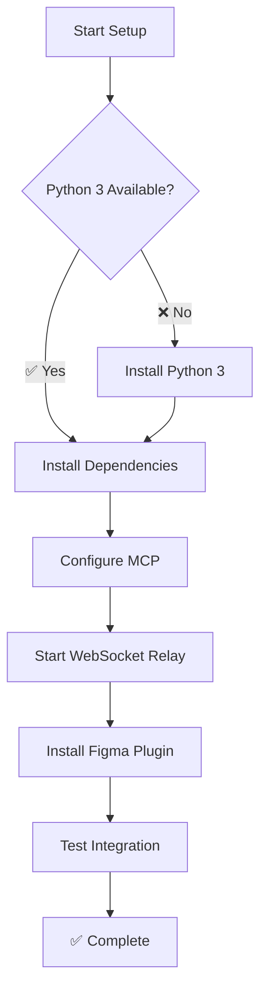
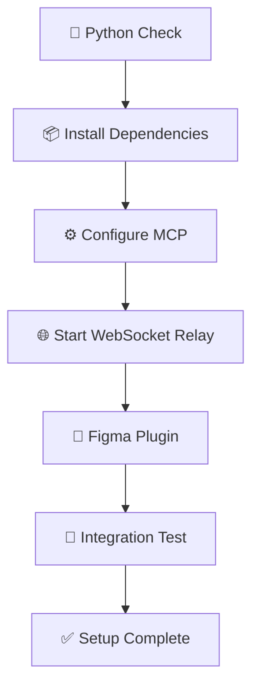
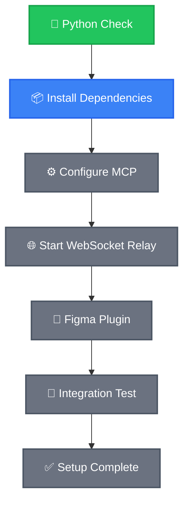
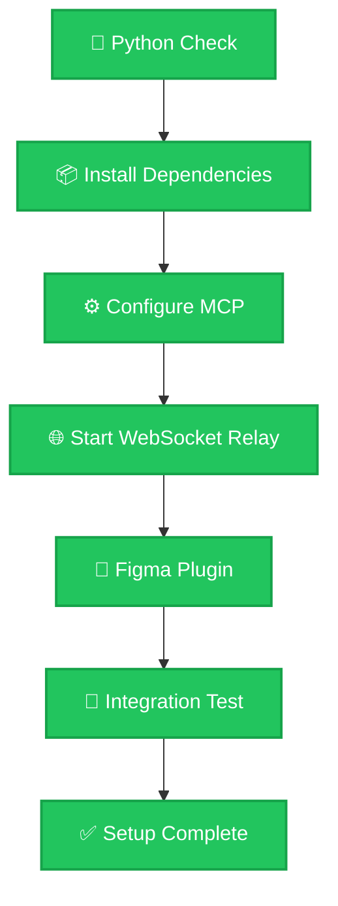

# README for AI Agent: Python MCP Setup Guide for talk-to-figma-mcp

## 🤖 AI Agent Decision Flow



## 🎯 Objective

Set up the **Python MCP server** for talk-to-figma-mcp so your AI assistant (Cursor, Claude Desktop, etc.) can read and modify Figma designs through natural language.

This guide uses Python 3 and pip — no Node.js, no Bun, no build step required.

### 🤖 For AI Agents Reading This Guide

This guide is designed for AI agents to parse and execute autonomously. Each section includes:

- **Clear checkpoint validations** before proceeding
- **Copy-paste commands** with expected outputs
- **Mermaid progress diagrams** to track and report status
- **Inline Windows notes** where commands differ

**AI Agent Instructions:**
1. Execute each command and verify the expected output
2. Update the progress diagram at every checkpoint
3. If a step fails, follow the troubleshooting section
4. Always validate checkpoints before continuing

## 📋 System Environment Detection

**AI AGENTS**: Run these commands first and store results for later decisions.

```bash
echo "=== PYTHON ENVIRONMENT DETECTION ==="

# 1. Operating System
OS_TYPE=$(uname -s)
echo "OS_TYPE: $OS_TYPE"

# 2. Python 3 availability
PYTHON_AVAILABLE=$(which python3 >/dev/null 2>&1 && echo "YES" || echo "NO")
if [ "$PYTHON_AVAILABLE" = "YES" ]; then
    PYTHON_VERSION=$(python3 --version 2>&1)
    echo "PYTHON_VERSION: $PYTHON_VERSION"
else
    echo "PYTHON_AVAILABLE: NO"
fi

# 3. pip3 availability
PIP_AVAILABLE=$(which pip3 >/dev/null 2>&1 && echo "YES" || echo "NO")
if [ "$PIP_AVAILABLE" = "YES" ]; then
    PIP_VERSION=$(pip3 --version 2>&1)
    echo "PIP_VERSION: $PIP_VERSION"
else
    echo "PIP_AVAILABLE: NO"
fi

# 4. Git availability
GIT_AVAILABLE=$(which git >/dev/null 2>&1 && echo "YES" || echo "NO")
echo "GIT_AVAILABLE: $GIT_AVAILABLE"

echo "=== DETECTION COMPLETE ==="
```

> **Windows note:** Replace `python3` with `python` and `pip3` with `pip` in all commands throughout this guide.

## 📊 AI Agent Progress Tracking

**AI AGENTS MUST CREATE THIS DIAGRAM** after environment detection and update it at each checkpoint:



### Status Indicators
- ✅ **COMPLETED** — Step finished successfully
- 🔄 **CURRENT** — Currently executing
- ⏳ **PENDING** — Not started
- ❌ **FAILED** — Needs attention

### 📍 Mandatory Progress Update Points

AI Agents MUST update the diagram at these checkpoints:
1. After Python check (Step 1)
2. After dependency installation (Step 2)
3. After MCP configuration (Step 3)
4. After WebSocket relay starts (Step 4)
5. After Figma plugin connects (Step 5)
6. After integration test (Step 6)

**Example update** (after Step 1 completes):



## 🚀 Step-by-Step Setup

---

### Step 1: Verify or Install Python 3

```bash
python3 --version
```

Expected output: `Python 3.10.x` or higher.

**✅ If Python 3.10+ is shown** — proceed to Step 2.

**❌ If command not found or version is below 3.10:**

**macOS:**
```bash
# Option A: via Homebrew (recommended if you have it)
brew install python3

# Option B: Download installer from https://www.python.org/downloads/
# After installing, reopen your terminal and run python3 --version again
```

> **Windows note:** Download from https://www.python.org/downloads/ and tick "Add Python to PATH" during installation. Use `python` instead of `python3` everywhere in this guide.

**CHECKPOINT 1** ✅ — `python3 --version` shows 3.10 or higher.

**AI AGENTS**: Update progress diagram — mark `🐍 Python Check` as **completed**, `📦 Install Dependencies` as **current**.

---

### Step 2: Install Dependencies

From the **repo root** directory:

```bash
pip3 install -r src/python_mcp/requirements.txt
```

Expected output: Lines ending with `Successfully installed mcp-... websockets-...`

**⚠️ If you see a permissions error:**
```bash
pip3 install --user -r src/python_mcp/requirements.txt
```

> **Windows note:** Use `pip` instead of `pip3`.

**CHECKPOINT 2** ✅ — No errors shown. Installation succeeded.

**AI AGENTS**: Update progress diagram — mark `📦 Install Dependencies` as **completed**, `⚙️ Configure MCP` as **current**.

---

### Step 3: Configure MCP in Cursor or Claude Desktop

First, find your Python 3 path:

```bash
which python3
# Example output: /usr/local/bin/python3
```

> **Windows note:** Run `where python` in Command Prompt. Use the path shown.

Then find the full path to `server.py` in this repo:

```bash
realpath src/python_mcp/server.py
# Example output: /Users/yourname/projects/talk-to-figma-mcp/src/python_mcp/server.py
```

**For Cursor:** Create or edit `.cursor/mcp.json` in this project:

```json
{
  "mcpServers": {
    "TalkToFigma": {
      "command": "/usr/local/bin/python3",
      "args": ["/Users/yourname/projects/talk-to-figma-mcp/src/python_mcp/server.py"]
    }
  }
}
```

**For Claude Desktop:** Edit `~/Library/Application Support/Claude/claude_desktop_config.json` (macOS):

```json
{
  "mcpServers": {
    "TalkToFigma": {
      "command": "/usr/local/bin/python3",
      "args": ["/Users/yourname/projects/talk-to-figma-mcp/src/python_mcp/server.py"]
    }
  }
}
```

> **Windows note:** Config file is at `%APPDATA%\Claude\claude_desktop_config.json`. Use `python` as the command and Windows-style paths (e.g., `C:\\Users\\yourname\\...`).

After saving the config, **restart Cursor or Claude Desktop** to pick up the change.

**CHECKPOINT 3** ✅ — MCP config file saved and app restarted. Verify TalkToFigma shows as "Connected" in Settings → MCP.

**AI AGENTS**: Update progress diagram — mark `⚙️ Configure MCP` as **completed**, `🌐 Start WebSocket Relay` as **current**.

---

### Step 4: Start the WebSocket Relay Server

Open a **dedicated terminal** and run:

```bash
python3 src/python_mcp/socket_server.py > relay.log 2>&1
```

This terminal will become unresponsive — that means the relay is running correctly. **Keep it open.**

To monitor logs in a second terminal:
```bash
tail -f relay.log
```

You should see: `WebSocket server running on port 3055`

To stop the relay later: press `Ctrl+C` in its terminal.

**Verify the relay is running:**
```bash
lsof -i :3055 && echo "✅ Relay running on port 3055" || echo "❌ Relay not running"
```

> **Windows note:** Use `netstat -an | findstr 3055` to check the port.

**CHECKPOINT 4** ✅ — `relay.log` shows "WebSocket server running on port 3055".

**AI AGENTS**: Update progress diagram — mark `🌐 Start WebSocket Relay` as **completed**, `🔌 Figma Plugin` as **current**.

---

### Step 5: Install and Connect the Figma Plugin

#### Install the Plugin

1. Open the plugin page: https://www.figma.com/community/plugin/1485687494525374295/cursor-talk-to-figma-mcp-plugin
2. Click **"Install"**

#### Connect to the Relay

1. Open any Figma file
2. Go to `Plugins` menu → `Cursor Talk to Figma MCP Plugin`
3. In the plugin panel, set the WebSocket URL to: `ws://localhost:3055`
4. Click **"Connect"**

The plugin should show a **"Connected"** status. Your relay terminal will log a new connection.

**CHECKPOINT 5** ✅ — Plugin shows "Connected". Relay log shows a new connection message.

**AI AGENTS**: Update progress diagram — mark `🔌 Figma Plugin` as **completed**, `🧪 Integration Test` as **current**.

---

### Step 6: Test the Integration

In Cursor or Claude Desktop (with MCP connected), run these commands:

**Test 1 — Join a channel:**
```
join_channel
```
Expected: "Successfully joined channel" message.

**Test 2 — Read your Figma document:**
```
get_document_info
```
Expected: JSON data describing your open Figma file.

**CHECKPOINT 6** ✅ — Both commands return successful responses.

**AI AGENTS**: Update progress diagram — mark ALL nodes as **completed**:



🎉 **Setup complete! Your AI assistant can now read and modify Figma designs.**

## 🔍 Troubleshooting

### Python Not Found

```bash
# macOS: install via Homebrew
brew install python3

# macOS: or download from python.org
# https://www.python.org/downloads/

# After installing, open a new terminal and retry:
python3 --version
```

---

### pip3 Fails — Permission Error

```bash
# Use --user flag to install to your home directory
pip3 install --user -r src/python_mcp/requirements.txt
```

---

### Port 3055 Already in Use

```bash
# Find and kill the process using port 3055
lsof -ti:3055 | xargs kill -9 2>/dev/null || true

# Wait 2 seconds, then restart the relay
python3 src/python_mcp/socket_server.py > relay.log 2>&1
```

> **Windows note:** Run `netstat -ano | findstr 3055` to find the PID, then `taskkill /PID <pid> /F`.

---

### Figma Plugin Not Connecting

1. Verify the relay is running: `lsof -i :3055`
2. Check relay.log: `tail relay.log` — look for errors
3. In the Figma plugin, confirm the URL is exactly `ws://localhost:3055`
4. Click Disconnect then Connect in the plugin panel
5. Refresh the Figma page and try again

---

### MCP Not Detected in Cursor / Claude Desktop

1. Verify the config file path is correct (see Step 3 above)
2. Confirm the `python3` path in the config matches `which python3`
3. Confirm the `server.py` path in the config is the full absolute path
4. Restart the app after any config change
5. Check Settings → MCP — TalkToFigma should appear as "Connected"
