# README for AI Agent: Python MCP Setup Guide for talk-to-figma-mcp

## 🤖 AI Agent Decision Flow

```mermaid
flowchart TD
    A[Start Setup] --> B{Python 3 Available?}
    B -->|✅ Yes| C[Install Dependencies]
    B -->|❌ No| D[Install Python 3]
    D --> C
    C --> E[Configure MCP]
    E --> F[Start WebSocket Relay]
    F --> G[Install Figma Plugin]
    G --> H[Test Integration]
    H --> I[✅ Complete]
```

## 🎯 Objective

Set up the **Python MCP server** for talk-to-figma-mcp so your AI assistant (Cursor, Claude Desktop, etc.) can read and modify Figma designs through natural language.

This guide uses Python 3 and pip — no Node.js, no Bun, no build step required.

### 🤖 For AI Agents Reading This Guide

This guide is designed for AI agents to parse and execute autonomously. Each section includes:

- **Clear checkpoint validations** before proceeding
- **Copy-paste commands** with expected outputs
- **Mermaid progress diagrams** to track and report status
- **Inline Windows notes** where commands differ

**AI Agent Instructions:**
1. Execute each command and verify the expected output
2. Update the progress diagram at every checkpoint
3. If a step fails, follow the troubleshooting section
4. Always validate checkpoints before continuing
