# README for AI Agent: Python MCP Setup Guide for talk-to-figma-mcp

## 🤖 AI Agent Decision Flow

```mermaid
flowchart TD
    A[Start Setup] --> B{Python 3 Available?}
    B -->|✅ Yes| C[Install Dependencies]
    B -->|❌ No| D[Install Python 3]
    D --> C
    C --> E[Configure MCP]
    E --> F[Start WebSocket Relay]
    F --> G[Install Figma Plugin]
    G --> H[Test Integration]
    H --> I[✅ Complete]
```



## 🎯 Objective

Set up the **Python MCP server** for talk-to-figma-mcp so your AI assistant (Cursor, Claude Desktop, etc.) can read and modify Figma designs through natural language.

This guide uses Python 3 and pip — no Node.js, no Bun, no build step required.

### 🤖 For AI Agents Reading This Guide

This guide is designed for AI agents to parse and execute autonomously. Each section includes:

- **Clear checkpoint validations** before proceeding
- **Copy-paste commands** with expected outputs
- **Mermaid progress diagrams** to track and report status
- **Inline Windows notes** where commands differ

**AI Agent Instructions:**
1. Execute each command and verify the expected output
2. Update the progress diagram at every checkpoint
3. If a step fails, follow the troubleshooting section
4. Always validate checkpoints before continuing

## 📋 System Environment Detection

**AI AGENTS**: Run these commands first and store results for later decisions.

```bash
echo "=== PYTHON ENVIRONMENT DETECTION ==="

# 1. Operating System
OS_TYPE=$(uname -s)
echo "OS_TYPE: $OS_TYPE"

# 2. Python 3 availability
PYTHON_AVAILABLE=$(which python3 >/dev/null 2>&1 && echo "YES" || echo "NO")
if [ "$PYTHON_AVAILABLE" = "YES" ]; then
    PYTHON_VERSION=$(python3 --version 2>&1)
    echo "PYTHON_VERSION: $PYTHON_VERSION"
else
    echo "PYTHON_AVAILABLE: NO"
fi

# 3. pip3 availability
PIP_AVAILABLE=$(which pip3 >/dev/null 2>&1 && echo "YES" || echo "NO")
if [ "$PIP_AVAILABLE" = "YES" ]; then
    PIP_VERSION=$(pip3 --version 2>&1)
    echo "PIP_VERSION: $PIP_VERSION"
else
    echo "PIP_AVAILABLE: NO"
fi

# 4. Git availability
GIT_AVAILABLE=$(which git >/dev/null 2>&1 && echo "YES" || echo "NO")
echo "GIT_AVAILABLE: $GIT_AVAILABLE"

echo "=== DETECTION COMPLETE ==="
```

> **Windows note:** Replace `python3` with `python` and `pip3` with `pip` in all commands throughout this guide.

## 📊 AI Agent Progress Tracking

**AI AGENTS MUST CREATE THIS DIAGRAM** after environment detection and update it at each checkpoint:

```mermaid
graph TD
    A[🐍 Python Check] --> B[📦 Install Dependencies]
    B --> C[⚙️ Configure MCP]
    C --> D[🌐 Start WebSocket Relay]
    D --> E[🔌 Figma Plugin]
    E --> F[🧪 Integration Test]
    F --> G[✅ Setup Complete]

    classDef completed fill:#22c55e,stroke:#16a34a,stroke-width:2px,color:#fff
    classDef current fill:#3b82f6,stroke:#2563eb,stroke-width:2px,color:#fff
    classDef pending fill:#6b7280,stroke:#4b5563,stroke-width:2px,color:#fff
    classDef failed fill:#ef4444,stroke:#dc2626,stroke-width:2px,color:#fff
```



### Status Indicators
- ✅ **COMPLETED** — Step finished successfully
- 🔄 **CURRENT** — Currently executing
- ⏳ **PENDING** — Not started
- ❌ **FAILED** — Needs attention

### 📍 Mandatory Progress Update Points

AI Agents MUST update the diagram at these checkpoints:
1. After Python check (Step 1)
2. After dependency installation (Step 2)
3. After MCP configuration (Step 3)
4. After WebSocket relay starts (Step 4)
5. After Figma plugin connects (Step 5)
6. After integration test (Step 6)

**Example update** (after Step 1 completes):


